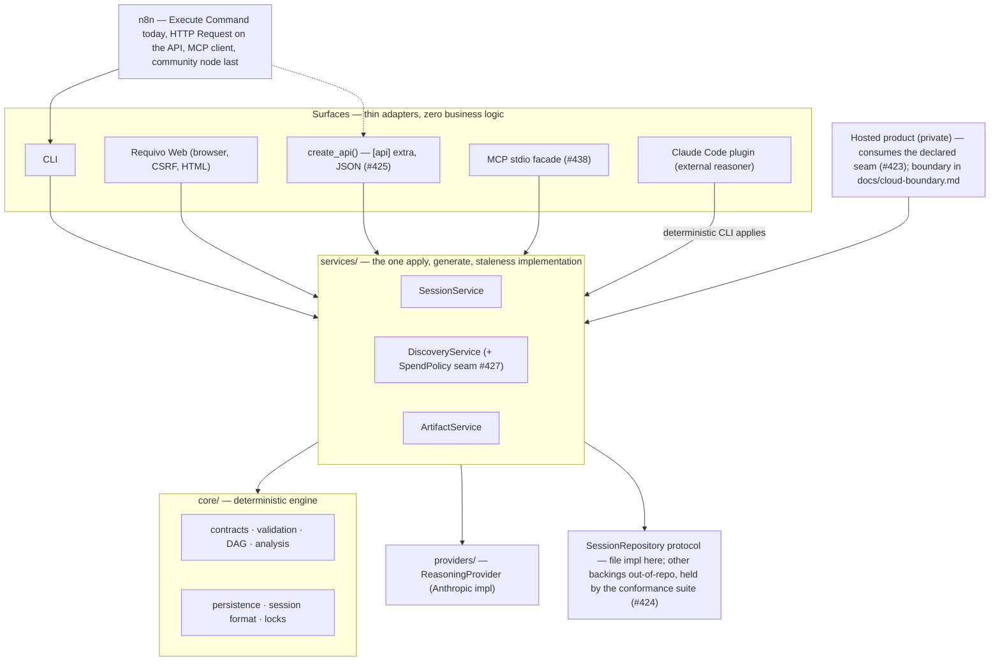

# Requivo — Product, Engineering & Commercial Readiness Audit

**Date:** 2026-09-01 · **Baseline:** `main` at v3.0.0 (tagged and on PyPI the same day) ·
**Method:** 31 agents across two orchestrations — 16 dimension-specialized audits over the full
tree and tracker, then 12 adversarial verifiers over every finding new enough to need one (38
claims confirmed, 18 adjusted on detail, 1 refuted) and 3 design passes (API, n8n, cloud boundary).
Every score below cites what it was computed from; every finding is bound to a tracker issue.
**Scope guard:** this audit follows the 2026-08-29 audit (104 issues, `#201–#303`) and re-validates
rather than re-derives it. Its three adversarially **refuted** findings stay refuted and were not
re-filed.

The deliverable set this report anchors: this file, [cloud-boundary.md](../cloud-boundary.md),
[integrations.md](../integrations.md), the decision record `decision: the-http-api-facade`, the
issue batch #419 + #421–#441, and the implementation log in §12.

---

## 1. Executive summary

**Overall: 7.3/10** (mean 3.66/5 over sixteen domains — scorecard in §4), up from a launch-shaped
audit three days ago whose entire P1 set has since shipped. Requivo is an unusually healthy
codebase whose operational surfaces are promised and guarded to a standard few OSS projects reach.
The pattern the previous audit named still holds and is still the master key: **the repo is strong
exactly where a test enforces a claim, and drifts exactly where none does.** Three days ago that
sentence pointed at prose, the funnel and the browser; today it points at the next ring out — the
Python import surface nothing declares, the HTTP surface that doesn't exist yet, and the one suite
promise that turned out to be environment-conditional.

**What changed since 2026-08-29.** 99 of the 104 audit issues closed via reviewed, squash-merged
PRs in three days; the five left open are deliberate, each annotated with its unmet criterion. The
paid path, the privacy guard, the examples, the visual assets and the prose front door — the whole
launch-blocking set — shipped across v1.3.0/v2.0.0/v3.0.0. Two regressions slipped in the same
window, and both say the same thing about guard coverage: the suite's hermeticity broke **inside
the v3.0.0 tree itself** (one journey test made a real paid API call and went red on any keyed
machine — found by this audit, fixed and merged the same day as #419/PR #420), and the golden
harness's assessment baselines went stale **one commit after** a deliberate 51-call re-capture
(#405's second recorded instance). Both were invisible to CI because CI cannot see them by
construction — keyless, and hash-blind to user messages.

**The five findings that matter most now:**

1. **The platform gap is real and priced.** There is no HTTP write surface for a machine: the web
   is CSRF-locked by design, so the entire automation contract is the CLI. Meanwhile the one
   external consumer that could not wait — the private hosted scaffold — predates the facade and
   shows the expected failure shape: a second orchestration past the services, addressing the
   workspace by process-environment mutation under a lock. That is the second orchestration this architecture exists to
   forbid, already alive. The answer is designed, not just diagnosed: `decision:
   the-http-api-facade` (build as #425), with the error-table relocation (#422) and the declared
   Python seam + `py.typed` (#423) as its first two bricks.
2. **#272 is no longer deferrable.** Its own written trigger — real hosted work against this repo
   as a dependency — fired. Five audit domains independently converged on the ambient workspace
   root as the single highest-leverage enabling change; the mechanism is decided (constructor
   state, store-object form — the ContextVar alternative evaluated and rejected in
   [cloud-boundary.md](../cloud-boundary.md) §3.1) and the issue is re-ranked priority-high.
3. **The suite's central promise needed to become structural.** "No API calls, no network" was
   true only where no credential resolved: `cli.py` loaded `.env` at import, `client=None` meant
   *build the default client*, and one test paid ~$0.07 per full-suite run on the documented dev
   setup. Fixed (#419): a three-layer autouse net, `load_dotenv` moved into `app()`, must-fire
   pair pinned. The exposed product bug remains open as #421: `answer` on a revision-0 session
   pays for a discovery-shaped call that **silently discards the answers it was given**.
4. **#169 is now the keystone, not just the long pole.** The product-validation protocol has still
   never run, and four open issues (#169, #232, #236, #252) all resolve on the same measured
   sitting — prepared down to a recording sheet, needing only the maintainer's half-day across two
   calendar days. Every "is this better than a strong prompt?" claim on every public surface is
   unreceipted until it runs. Nothing an agent can do substitutes for it.
5. **Spend has a ledger and no ceiling.** Nothing anywhere refuses on accumulated cost, and
   adversarial verification showed the local write surface is already scriptable by design. The
   moment any automated trigger ships (API, n8n), attacker-influenced inbound text becomes paid
   calls with no bound — the exact "burn the key" damage class the web guard names. #427 puts the
   ceiling at the service layer, where every surface inherits it.

**Go / no-go, per ambition** (details in §8–§10): wider OSS adoption — **go**, after the P1 batch
(the funnel is genuinely good; what's missing is receipts, not features). Stable API — **design
go, freeze no**: build experimental now, freeze only behind #272 + #238 + #426. n8n — **go today
on the CLI contract** (documented in [integrations.md](../integrations.md)); HTTP Request node
follows the API; community node gated on measured stability. Cloud beta — **not yet**: the minimal
upstream set (§10) is six changes, ordered, and the first two are in flight.

---

## 2. Disposition of the 2026-08-29 audit

Verified item by item against the tree and tracker (not assumed from memory):

| Prior finding (the P1 set + carry-overs) | Status today |
|---|---|
| #201 missing-key traceback · #202 persist-before-assessment · #203 htmx errors · #204 model.json tracebacks · #211 privacy gitignore | **RESOLVED** — each via a merged PR with a named must-fire test |
| #222 examples reproduce · #223 impact-as-hero · #225/#233 README funnel · CONTRIBUTING/templates (#279/#280) | **RESOLVED** |
| #224 visual proof | **RESOLVED today** — the finished video missed three releases waiting for a tag; published 2026-09-01 as v3.0.0 release assets (assets can join an existing release); README link rides this batch |
| #228 cut a release | **RESOLVED three times over** (v1.3.0, v2.0.0, v3.0.0 — which raised its own finding, #440) |
| #169 validation run (+ #232, #236, #252 riding on it) | **STILL OPEN — the one item only the maintainer can move**; day-0 sheet prepared |
| #272 workspace-as-constructor-state | **TRIGGER FIRED** — re-ranked priority-high, mechanism decided, implementation started |
| #405 golden staleness visibility | **STILL VALID, second instance recorded** — the detector must watch the generator user-messages, not just assets |
| The three refuted findings (archive-import extraction; `out/` retirement; CI advisory-echo strip) | **STAY REFUTED** — none re-filed, standing decisions |

Tracker hygiene is exceptional and is itself a strength: honest partial closures, refutation
discipline held, external contribution live (#340 claimed by an outside contributor within a day
of labeling).

---

## 3. What is genuinely excellent

Curated to what a newcomer should not mistake for ordinary:

1. **The layering is real, not aspirational** — AST-derived import graph: zero cycles, core
   reaches only core/paths, render only core+usage; `tests/test_source_form.py` enforces it from
   both ends with per-(file,name) argued allowlists.
2. **The promise ledger** — `docs/compatibility.md` classifies every operational surface with a
   testable contract sentence; fifteen `--json` payloads shape-pinned in both directions; the epic
   envelope versioned with a per-version skeleton test.
3. **Money honesty** — spend recorded on every exit including failures, rates stamped at call
   time, dollar costs stated before the first paid command and recomputed from the rate table by a
   test on every build.
4. **Failure-path maturity** — differentiated provider errors, pre-payment refusals wherever
   staleness is knowable, crash-released OS locks outside renameable directories, a bounded
   Windows-rename retry, three-state answers (an unreadable thing is neither present nor absent)
   used consistently from listings to exit codes.
5. **The security posture of the web surface** — four-layer cross-site guard as middleware,
   strict same-origin CSP, zero cookies, structural HTML escaping, LLM output treated as
   attacker-influenced on every render path (one residual CLI gap: #430).
6. **Hermetic speed** — the whole offline suite in ~45 s, zero network (structural since #419/PR #420), with
   concurrency tests that contend on real file descriptors and skips that name what goes untested
   and which CI leg covers it.
7. **Supply-chain discipline** — OIDC trusted publishing with SHA-pinned actions and live PEP 740
   attestations; floors verified by a resolver leg that has caught real shipped defects;
   `versioning-strategy: increase-if-necessary` protecting deliberate ceilings.
8. **The differentiator ships** — computed change-impact is offline, deterministic, sub-second,
   and now the hero of the demo; the keyless funnel (demo → web example) is honest about cost and
   needs no key for its first two beats.
9. **Docs guarded like code** — CLI flag tables read against `--help`, cost figures recomputed,
   examples executed by tests, decision records slug-referenced with resolution enforced.
10. **A tracker that self-corrects** — issues carry their own re-derivations, wrong evidence gets
    corrected in comments, and closure velocity (99 issues in three days) came with a post-merge
    review pass that found real defects.

---

## 4. Scorecard

Scale: 1 prototype · 2 functional-but-fragile · 3 solid · 4 production-ready · 5 mature/scalable.
Targets: before wider OSS adoption / before a cloud beta. Full rationale per row lives in the audit
working set; one clause each here.

| Domain | Now | OSS | Cloud | The clause that sets the score |
|---|---|---|---|---|
| Prior-audit follow-through & tracker | 4 | 4.5 | 4.5 | 99/104 closed with review; the drift instances were caught by this audit, not by a guard |
| Architecture | 4 | 4 | 4.5 | verified layering and load-bearing seams; ambient workspace identity (#272) is the one structural leak |
| **API readiness** | **2.5** | 3 | 4 | the substrate is wire-ready (errors, concurrency, payload pins) and the surface does not exist; design now recorded |
| Persistence / cloud readiness | 3 | 3.5 | 4.5 | repository seam proven backing-agnostic; ambient root + no delete + undeclared seam are the gap set |
| Security | 4 | 4.5 | 4.5 | prior backlog shipped with tests; forward gaps are designed-not-guarded (spend ceiling #427, machine auth with the API) |
| Provider / LLM layer | 4 | 4.5 | 4.5 | engineered retry/billing honesty; cost-structure trio (#256–#259) and golden staleness (#405) still open |
| Testing | 3.5 | 4 | 4.5 | per-test quality among the best reviewed; hermeticity had to be made structural (#419); product quality still has no floor (#169) |
| CI / packaging / supply chain | 4 | 4.5 | 4.5 | 16 required checks (the two "pending" appends executed by this audit); sdist half-ships its tests (#431); 3.14 untested (#298) |
| Web UX / UI / accessibility | 3.5 | 4 | 4.5 | verified AA palette and honest states; no-JS claim false on the core loop (#428); keyless demo stops before the promised brief (#429); no live-SR pass ever |
| Docs & developer experience | 4 | 4.5 | 4.5 | timed frictionless onboarding; drift only where unguarded (route table, doctor row — fixed in this batch) |
| Product strategy | 3.5 | 4 | 4.5 | the moat ships and demos; the claim is unreceipted (#169) and the estimate — the job-2 artifact — is invisible (#426/#232) |
| Ops / config / observability | 3.5 | 4 | 4.5 | env surface small and contractual; no deployment artifact for "self-hostable", zero log records below web (#435) |
| Public interfaces | 4 | 4.5 | 5 | operational surfaces exemplary; the Python seam is consumed downstream and declared nowhere (#423) |
| Reliability / performance | 4 | 4.5 | 4.5 | no cliff in the 1→1000 range (measured); ~70% of CLI cold-start is an eager SDK import; latency reality vs waiting copy rests on #169's timings |
| Community & go-to-market | 3 | 4 | 4 | furniture complete and honest; supply thin (one good-first-issue), receipts missing (video now shipped; side-by-side and estimate sample still absent) |
| Legal / privacy / data governance | 4 | 4.5 | 5 | Apache-2.0 migration verified complete; no data-flow doc yet; deletion is a governance gap (#238) |

---

## 5. Findings by priority

Every finding verified adversarially unless marked; every row has an issue. XS<30 min, S<2 h,
M<1 day, L>1 day.

### P0 — was one, fixed the same day

| Finding | Issue | State |
|---|---|---|
| The "no API calls" suite makes a real paid call and goes red on any machine with a resolvable credential (introduced in the v3.0.0 tree; confirmed by five independent reproductions, ~$0.06–0.08 per run) | #419 | **Fixed & merged** (PR #420): three-layer autouse net, `load_dotenv` out of import time, must-fire pair |

### P1 — before wider adoption

| Finding | Effort | Issue |
|---|---|---|
| `answer` on a revision-0 session pays for a discovery-shaped turn that silently discards the answers; bypasses the double-pay guard; the remedy text routes users into it | S | #421 |
| The error-code→HTTP-status table is trapped in the `[web]` extra; the downstream copy already collapses every engine error to 502 | S | #422 |
| The Python import seam is consumed downstream, disclaimed in docs, untyped (`py.typed` absent) — declare it before anything hardens against the accidental surface | M | #423 (after #272) |
| #272's trigger fired: ambient workspace root blocks clean hosted consumption and any multi-workspace API; mechanism decided | L | #272 (re-ranked) |
| #169 + its dependent cluster (#232 sample, #236 timings, #252 ledger) — the only maintainer-bound item; everything else on the board is agent-runnable | JB | #169 |
| The demo video missed three releases; published today, README link in this batch closes #224 | XS | #224 |
| Session delete reframed: an erasure primitive on the repository protocol — data governance + cloud prerequisite + API lifecycle, not a UX nicety | L | #238 (re-ranked) |

### P2 — the working set (curated; each issue carries full evidence)

| Cluster | Findings → issues |
|---|---|
| API/platform | build the experimental facade (#425) · estimate-artifact decision (#426) · spend ceiling at the service layer (#427) · conformance suite (#424) · MCP facade (#438) |
| n8n | epic-envelope provenance v2 (#274, re-ranked) · example workflows (#437) · events derivation, gated (#436) |
| Web | no-JS submits silently discard typed answers + leak the token into the URL, against a shipped works-without-JS claim (#428) · keyless example under-delivers the README's promised brief (#429) · screenshots decay with every web release, regeneration script > re-shoot (#329) |
| Security | `artifact show` prints LLM bytes raw — last member of the #213 class (#430) · gitleaks-action on a mutable tag with a write scope (#433) |
| Testing/CI | golden staleness needs the report line, watching generator code too — second instance recorded (#405) · sdist test suite uncollectable, decide whole-or-none (#431) · one test leaks debug dumps into the developer's real workspace (#432) · coverage measurement absent (#295) · a 3.14 leg before 3.15 lands (#298) |
| Governance/docs | versioning-cadence policy for integrators (#440) · DCO decision while contributors are two (#439) · data-flow document (outline in the legal pass; lands after this batch) · model-id injection on the provider (#434) · observability primitives (#435) |

### P3 — recorded, deliberately behind everything above

Cold-start SDK-import laziness (~70% of every CLI invocation) · `SessionService.impact()` as a
service read (rides #425's first slice) · the git-native team story promoted or deliberately kept
quiet · `lang=` attributes riding #277's language-policy decision · env-var single reference page ·
release-notes contributor credit as a standing line (both existing releases were edited today) ·
the small prose-drift pack (fixed in this batch).

---

## 6. Risk register

| Risk | Likelihood | Impact | Horizon | Mitigation | Issue |
|---|---|---|---|---|---|
| The core claim stays unreceipted through launch — the story rests on architecture and prose | High (default outcome) | High | Weeks | Run the protocol; publish the side-by-side, losses included | #169 |
| Hosted work hardens against the undeclared Python surface; every refactor silently breaks the one consumer that matters | High | Medium | Weeks | #272 → declare the seam + `py.typed` + exact-pin policy → conformance suite | #423/#424 |
| Automation (API/n8n) ships before any spend ceiling; hostile inbound text drives unbounded paid calls | Medium | High | Months | Service-layer SpendPolicy lands with or before the facade's write routes | #427 |
| A second suite-hermeticity-class regression (CI structurally blind: keyless, hash-blind) | Medium | Medium | Ongoing | The #419 net closes the credential class; #405's report line closes the golden class; #432's guard closes the workspace-leak class | #405/#432 |
| Erasure request against a product whose wedge is confidentiality, with no supported delete | Medium | High | Months | #238 as the erasure primitive on the protocol | #238 |
| Three-majors-in-13-days cadence converts honesty into integrator churn post-adoption | High | Medium | Months | Write the cadence policy; name the recommended pin | #440 |
| The web's shipped claims drift from the product (no-JS claim, keyless-brief promise, screenshots) | Certain (three instances live) | Medium | Weeks | #428, #429, #329's regeneration script | — |
| Interpreter window: 3.14 eleven months stable and tested nowhere; 3.15 in ~5 weeks | High | Medium | Weeks | Add the 3.14 leg now; decide the 3.9 floor on download data later | #298 |

---

## 7. Architecture — current and target

Current state, verified empirically this audit (import graph, boundary tests, live runs): the
strict DAG holds — `cli.py`/`deterministic/`/`web/` → `services/` → `core/`, with `providers/`
reached only through the seam and `render/` pure. The services are the integrity boundary in fact,
not just in prose: input caps, card resolution, revision gates and snapshot discipline all live
there, which is exactly what makes new surfaces cheap.

Target (the point of the platform work — every box a thin adapter, no box a second implementation):

Dependency spine of the roadmap (§11): `#272 → #423 (+py.typed) → #424`; `#422 → #425 skeleton →
#425 writes → {#438 MCP, n8n HTTP set} → community node`; `{#272, #238, #426} → API v1 freeze`;
`#274 → #437 examples`; `#169 → {#232, #236, #252} closures + the launch post`.

---

## 8. API readiness — 2.5/5

The full design is `decision: the-http-api-facade`; the audit's contribution is that the gap is now
a plan with named preconditions instead of a roadmap line. What holds the score down: no write
surface exists; the status table lives behind the `[web]` extra (#422); long operations have a
recovery story but no streaming (#256); auth and spend are unstated (#427); and three contract
movers have owners but no landings (#272, #238, #426). What holds it *up*: the error envelope,
optimistic concurrency, idempotent creation, pinned payload shapes and the status resource all
exist and are already public promises. **Blockers to freeze, in order: #272, #238, #426.** Build
is not blocked at all — #425 can start after #422.

## 9. n8n readiness — 2/5 today, by design rather than neglect

Inbound **today** is real and now documented ([integrations.md](../integrations.md)): deterministic
slugs from file stems, free idempotency from the revision-zero gate, `status --json` as the state
read, machine-consumable tracker plans at stable paths, exit codes an orchestrator can branch on.
What blocks more: no HTTP writes (the CSRF design is correct for browsers and terminal for
scripts), no provenance in the epic envelope (#274 — the one code prerequisite), no events (the
polling cursor is honest; the derivation is designed and gated, #436). Outbound webhook delivery is
**deliberately never OSS** — the revision log is the outbox; delivery is hosted-product
infrastructure. Sequence: #274 → examples (#437) → API minimal set (#425) → MCP (#438) → community
node (gated on measured stability).

## 10. Cloud readiness — 3/5

The boundary document ([cloud-boundary.md](../cloud-boundary.md)) is the deliverable; the score is
the seam's, not the scaffold's. Proven: the repository protocol runs the full orchestration on a
non-file backing (`test_session_service_runs_unchanged_on_a_non_file_repository`); locks, format
versioning and cost attribution are worker-model-ready. The minimal upstream set, ordered, each
with a meanwhile: **#272** (constructor-state root) → **#423** (declared seam + `py.typed`) →
**#422** (status table out of `[web]`) → **#424** (conformance suite) → **#238** (delete as
erasure, on the protocol) → **#434** (model-id injection). Nothing else upstream is required for a
beta; everything else on the hosted side is that repo's own concern and stays there.

---

## 11. Roadmap

Phases are dependency-shaped, not calendar-shaped; §7's spine is the order.

- **Phase 0 — done within this audit** (§12): the P0, the tracker, the deliverable docs, the
  quick wins.
- **Phase 1 — trust & foundations (now):** #421 · #422 · #272 · #405 · #432 · the required-check
  append (done) · #433. Everything here is agent-runnable.
- **Phase 2 — receipts (maintainer-bound, parallel):** #169 day-0 → #232/#236/#252 closures →
  the comparison page → launch post. Plus #329's screenshot script.
- **Phase 3 — the platform:** #423 → #424; #425 skeleton → writes → #427 · #426 decided · #429 ·
  #428.
- **Phase 4 — integrations:** #274 → #437; #438; n8n HTTP set; #436 when its gate is met.
- **Phase 5 — cloud enablement finishes:** #238 · #434 · #435; the API freeze event.
- **Phase 6 — polish & posture:** #430 · #431 · #298 · #439 · #440 · #295 · data-flow doc ·
  cold-start laziness · #277.

## 12. Implementation log (2026-09-01, the audit session itself)

- **#419 → PR #420, merged**: suite hermeticity made structural (1,475 green, 44 s, zero network,
  with a real key present); reviewed with revert-testing of every guard before merge.
- **Issues:** #419, #421–#441 filed (this batch); #272/#274/#238 re-ranked with the decisions
  recorded on their threads; #277 given the `lang=` half; #234's description half executed live.
- **Direct actions:** demo video + poster published as v3.0.0 release assets (#224's three-release
  miss ended); the two "pending" required checks appended (14 → 16, decision record 0001 updated
  in this batch); both existing releases' notes now credit the first two outside contributors;
  the #169 day-0 recording sheet prepared.
- **In flight as this lands:** #421, #422 and #272 implementations on branches.

## 13. NOT NOW

Consolidated from every domain; each entry has a written trigger, and re-litigating one without
new evidence is the anti-pattern:

- **No telemetry, crash reporting or phone-home, ever, in the local product** (standing; restated).
- **No second LLM provider and no neutral-layer extraction** until decision 0003's trigger fires.
- **No auth/multi-tenancy in this repo's web app**; the API's bearer token is "my other machine",
  never identity.
- **No webhook delivery in OSS** (the derivation is the primitive; delivery is hosted infra).
- **No Postgres in OSS** — the protocol + conformance suite is the boundary; implementations live
  with their deployments.
- **No jobs/queue resource in the API v1**, no pagination, no `Idempotency-Key` machinery — each
  rejected with reasons in the decision record.
- **No n8n community node before measured API stability**; no MCP before the API's write routes.
- **No new meta-guards over prose/CI without two named instances** (the estate stays at budget; the
  #419 net and the #432 guard are runtime enforcement, not prose guards).
- **No UI translation** (labels.py centralizes the future hook); no dark-mode toggle; no
  Kubernetes/Helm before a Dockerfile has a user; no SBOM until an enterprise consumer asks.
- **No CLAUDE.md compression before #285 proves the pattern on src/** (still correctly sequenced).

## 14. Method appendix

Two orchestrations on 2026-09-01. First: 16 domain auditors (prior-disposition, architecture, API,
persistence/cloud, security, provider/LLM, testing, CI/packaging, web UX/UI/a11y, docs/DX, product
strategy, ops/config/observability, public interfaces, reliability/perf, community/GTM,
legal/privacy), read-only, offline, each re-validating the 2026-08-29 findings in its domain before
adding its own; 733 tool calls. Second: 12 adversarial verifiers instructed to refute (default
REFUTED when not reproducible) over every new finding cluster, plus 3 design agents (API, n8n,
cloud boundary); 571 tool calls. Verification outcome: 38 confirmed / 18 adjusted / 1 refuted —
the refutation (the web's CSRF token *is* obtainable by a same-host scripted client, by documented
design) materially improved the spend-ceiling finding rather than killing it. The orchestrator
independently reproduced the P0 before any agent reported it. Total agent spend: ~4.3M tokens;
zero paid provider calls beyond the P0's own reproductions (~$0.20 across five, disclosed).
