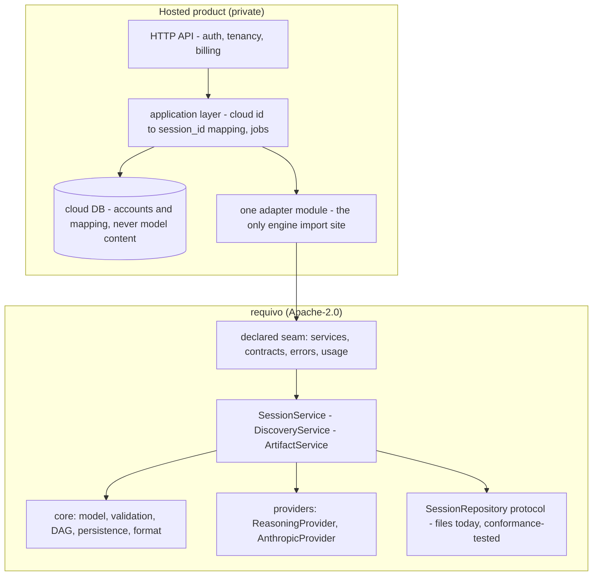

# The cloud boundary

> Where the open engine ends and a hosted product begins: what each side owns, how a private
> deployment consumes the public package, and the short list of upstream changes that make that
> consumption clean.

[open-source-strategy.md](open-source-strategy.md) draws the *distribution* boundary — what is
Apache-2.0 and what stays private — and accepts, in its own words, that third parties may host
Requivo as a service. This page is the *consumption* boundary: the contract any hosted product,
first-party or not, builds against, written against a real first-party deployment scaffold.

Two rules govern everything below, and each is the other's mirror:

- **The engine never names a cloud noun.** Stripe, Kubernetes, AWS, a queue, a secrets manager, an
  observability vendor — none of these appears in `core/`, `services/`, `providers/` or `render/`,
  ever. The self-hosted story in open-source-strategy.md is only true while a `pip install requivo`
  carries no opinion about anyone's infrastructure, and the rule is the same shape
  `tests/test_source_form.py` already enforces for provider imports: a cloud noun in the engine
  would earn a row there, with its reason.
- **The hosted product never reimplements an apply, a generation, or a staleness rule.** CLAUDE.md
  already says it for the three local surfaces — *"there is never a second implementation of an
  apply, a generation, or a staleness rule"* — and a hosted deployment is the fourth surface, not
  an exception. An adapter calling the provider's free functions plus `SessionService` directly —
  the CLI's shape before #77 — applies with no `expected_revision`, persists no artifact, tracks no
  staleness and stamps no spend: orchestration `DiscoveryService` already owns. Consume the service.

## 1. The responsibility split

The membership test for any new concern: **would a self-hoster running `requivo web` need it?** If
yes, it belongs in this repository; if it only exists because more than one person shares a
deployment, it is cloud-only.

| Concern | `requivo` (Apache-2.0) | Hosted product (private) |
|---|---|---|
| Engine & model | slots, validation, readiness, the dependency DAG, diff/impact | — |
| Services | `SessionService` / `DiscoveryService` / `ArtifactService` — the only apply, generate and staleness implementations | — |
| Persistence contracts | `SessionRepository` protocol, the session format + `migrate_session`, locks | the Postgres *implementation* of the protocol, the managed database, backups |
| Providers | `ReasoningProvider` protocol, the Anthropic implementation, the dated rate tables | per-tenant key custody, quotas, spend enforcement |
| Interfaces | CLI, local Web, a future local API (same shape: local, single-user, no auth), the Claude Code plugin | the hosted HTTP API, the product UI, admin |
| Integrations & adapters | epic export, the pure `to_github()`/`to_gitlab()` transforms | the authenticated pushes those plans feed (deliberately out of this repo already), webhooks, inbound email |
| Accounts & tenancy | — | accounts, organisations, tenancy, cloud auth, billing |
| Execution | — | workers, queues, scheduling, retries |
| Ops | — | secrets management, observability backends, infrastructure |
| Format & migrations | `format_version` / `schema_version` frontiers and every migration | the *operational* discipline around them (§8) |

## 2. The consumption contract

- **The declared seam**, priced like everything else in
  [compatibility.md](compatibility.md#the-python-import-surface--the-declared-seam-423): the
  services and their result types, the two protocols (`SessionRepository`, `ReasoningProvider`), the
  contracts a consumer holds, the failure vocabulary and `requivo.usage`. Everything else is
  explicitly unstable; moving a declared name costs a major. The package ships `py.typed`, so a
  consumer's adapter type-checks against it.
- **The pin: exact, not a range** — `requivo==X.Y.Z`, bumped as a routine chore gated by the
  conformance suite and the consumer's own tests. A major prices a break to *anything* on the
  compatibility page, usually the CLI or a `--json` payload rather than the Python seam, so a range
  ceiling reads as prudence and works as starvation
  (`decision: a-release-is-justified-by-its-contents`).
- **The repository conformance suite** (`requivo.testing.repository_conformance`, #424): what the
  services assume of a backing — lock exclusion and per-thread re-entrancy (invariant 9),
  `expected_revision` refusal (invariant 2), the three-state listing (invariant 15), `load_artifact`
  returning `None` for absent and raising on refusal, unknown-key preservation (invariant 8). A
  Postgres implementation that passes it inherits the services verbatim.

## 3. The upstream change set

Each landed; what a hosted consumer relies on:

- **#272 — the workspace is constructor state** (#446). `FileSessionRepository(root=...)`, defaulting
  to `paths.workspace_root()`, so one process addresses many workspaces without mutating
  `os.environ` under a process-wide mutex. Constructor state rather than a `ContextVar`: a queue
  worker is another process no context crosses, and an unbound root falling back to cwd is a silent
  data-placement hazard (the usage ledger is a `ContextVar` because "no ledger" is a safe no-op; "no
  root" is not). *Flagged remainder:* `user_context_dir()` (`REQUIVO_CONTEXT_DIR`) is still ambient,
  until per-tenant cards are a real feature.
- **The declared seam + `py.typed`** (#423), §2.
- **The error-to-status table leaves `[web]`** (#422): `requivo/http.py`'s `http_status_for`, so a
  hosted API maps `revision_conflict` to 409 and `session_not_found` to 404 instead of a blanket 502.
- **The conformance suite ships in the wheel** (#424), §2.
- **Delete on the protocol, as erasure** (#238, #469): the store takes the session lock, removes the
  directory and unlinks the lock file last, so offboarding goes through the same seam as every other
  mutation and retains nothing — never an `rm -rf` around the lock.
- **Optional model id on the provider** (#434): `AnthropicProvider(client=…, model=…)` calls, prices
  and records independently of `REQUIVO_MODEL`. `DiscoveryService` does not forward a model id
  itself; pass it a constructed provider (`DiscoveryService(provider=…)`).

## 4. Identity and tenancy

- **Slugs stay what they are: workspace-scoped naming.** Unique within one workspace only, minted
  from the request, re-minted with a hash suffix on collision. A slug is never a global key and
  never becomes one.
- **`SessionMeta.session_id` is the stable key.** A uuid4 stamped at creation (uuid5 for sessions
  brought in from the legacy layout), carried in `session.json`, and therefore the one identity
  that survives `session export` / `session import` and any future rename. The hosted mapping row
  records it; a cloud-side public id may exist alongside, but the join to the store is this field.
  (A consumer minting its own id without recording the engine's has one identity too many.)
- **Cloud owns the mapping** tenant / cloud-id → (workspace root, slug), and the layout. Two
  legitimate layouts: **one workspace per session** (strongest isolation,
  delete retires the directory, the DB is the only tenant-level listing) and **one workspace per
  tenant** (engine-native `session list`, whole-workspace export — the "continue locally" story —
  at the cost of a tenant-visible slug namespace and a genuinely shared write domain). Start
  per-session; per-tenant is a product decision to take deliberately.
- **The invariants a deployment must preserve, whatever the layout:**
  1. **One kernel per workspace at a time.** Every exclusion here is an advisory `flock` — the
     30-second-bounded `session_lock`, and the `_discovery_guard` held *across* a paid provider
     call to refuse a concurrent first discovery before it spends anything (#209). A flock excludes
     only writers on the same kernel: two pods over one network volume are two kernels, and every
     one of those guarantees silently stops existing. Pin each workspace's writes to one node —
     with per-session workspaces, "one in-flight job per session" (queue dedup) is sufficient — or
     front the store with a distributed lock the deployment owns. The engine will not grow one:
     that is a cloud noun (rule 1).
  2. **Locks are advisory, so bypass is always possible** — which is why erasure belongs on the
     protocol (§3) rather than in a `shutil.rmtree`.
  3. **Never two engine versions writing one workspace concurrently.** compatibility.md's
     mixed-version promises are about tolerance across *time*, and its own note records that an
     older Requivo locks a different file than a newer one. A deployment controls its image, so
     this costs nothing: one engine version per deployment, drain in-flight jobs across an upgrade.
  4. **The workspace is the unit of consistency.** Tenant-wide search and analytics read the cloud
     DB or exported snapshots — never a glob across live workspaces under write load.

## 5. Statelessness and jobs

A provider call is synchronous, non-streaming, and runs seconds to minutes by design
(`MAX_OUTPUT_TOKENS` is 16k because the SDK risks HTTP timeouts above it). The engine is
synchronous Python throughout — and at this seam that is a feature: sync code runs identically
under a threadpool and in a queue worker, so the deployment chooses the execution model and the
engine's guarantees hold under both.

**Request-held threadpool** (sync-def routes → `anyio.to_thread.run_sync`): ContextVars cross into
the worker thread (anyio copies the caller's context), so a `track_usage()` scope opened in the
handler is the one the provider files into. What it does not fix: the request holds a slot for the
whole reasoning, and a client timeout, LB idle limit or redeploy lands mid-call — tokens spent,
apply never landed.

**Job queue** (recommended once real users exist): enqueue `{session_id, operation,
expected_revision}`, worker executes the `DiscoveryService` operation, client polls or streams the
row. A queue worker is a CLI-shaped caller, which is the caller this engine is hardened for:

- **Bind the ledger at job start.** No context crosses a process boundary; `track_usage()` opens
  inside the job. Forgetting is tolerated by the engine (`record_call` no-ops with no ledger open),
  which means spend silently unrecorded — so the worker harness owns the binding, not each job body.
- **Snapshot discipline is the engine's, not the deployment's.** Every reasoning operation takes
  one coherent `SessionSnapshot` under the session lock (invariant 12), releases the lock before
  the paid call, and carries the snapshot's revision as `expected_revision` into the apply and as
  `source_revision` onto the artifact — so interleaved writes become a clean `revision_conflict`
  (409, §3) or an honestly-stale artifact, never a silent overwrite. `generate("brief")` even
  survives losing the race: the paid assessment is still saved against its true source revision,
  flagged stale, with the conflict named (#208).
- **Crash story = the CLI's ctrl-C story.** Both flocks are kernel-held and die with the process;
  the only residue is a dot-prefixed scratch file, the class the store already documents. A retried
  first-discovery job is refused free by the revision-zero gate before it can pay; a retried
  refinement conflicts cleanly on `expected_revision`. Queue-level dedup (one in-flight job per
  session) is the deployment's complement to the kernel-scoped `_discovery_guard`.

## 6. Eventing and observability

Landed (#435), stdlib-only and silent by default: `requivo/__init__.py` attaches a `NullHandler` to
the top-level `requivo` logger, so a WARNING+ record never reaches `logging.lastResort` on stderr
when nothing else in the process configured logging.

- **Named loggers at the service seams** — `requivo.services.discovery`, `.sessions`,
  `.artifacts` — emitting the handful of events an operator acts on: a session created, a model
  applied (slug, revision, changed/stale counts), a write conflict refused, an artifact saved (type,
  source revision, stale verdict), and a provider call started/finished/failed (operation, duration
  in ms) at the orchestration layer. No handlers, no formatters, no configuration: silent by
  default, attachable by anyone.
- **`requivo.providers.anthropic.completion` (optional, a child of `requivo.providers...`)** — the
  one place a call's *attempts* and latency are actually known, since every other layer only sees
  the typed result or a raised error. Logs a call completed (DEBUG) or gave up (WARNING) — a
  transport failure, a truncated reply, or the retry loop exhausted — with the operation, model,
  attempts and latency. A caller wanting per-HTTP-call detail attaches here or to `requivo.providers`
  and gets it via propagation; nobody does by default.
- **An `operation` field on `CallRecord`** (optional, default `None`). The ledger records model,
  tokens, cache tiers, latency and the rate a call was billed at — but not *which operation* spent
  them, so per-verb metering ("a brief costs X, a discovery turn Y") was reconstruction. One
  additive dataclass field, stamped at every `_complete()` call site in `providers/anthropic/
  generators.py` with the same vocabulary `_OP_PROMPTS`/`cli.py`'s subcommands already use
  (`analyze`, `brief`, `stories`, `prd`, `criteria`, `epic`, `release`, `estimate`). Nothing in this
  package reads it back; it is for an embedding operator's own metering.

Everything else attaches on the deployment's side: handlers, OTel, request-id correlation, metrics,
billing pipelines reading the ledger per job, alerting. And deliberately **no more than this** — no
event bus, no callback registry, no middleware seam. A logger *is* the hook, and the bar for
anything richer is the repo's own two-named-instances rule (#288): two real consumers with needs a
logger cannot serve, named by issue number.

## 7. Secrets and configuration

Local configuration stays env-only and SDK-resolved, unchanged: `new_client()` takes no arguments
on purpose — it asks the SDK to run its whole credential resolution (env vars, profile, workload
identity federation, #334) and refuses cleanly when nothing resolves.

A hosted deployment never touches that path. It constructs the SDK client itself and injects it —
`AnthropicProvider(client=Anthropic(api_key=<tenant key>))`, or the same through
`DiscoveryService(client=…)` — so per-tenant credentials involve no environment writes and no new
upstream surface. Custody, rotation and encryption-at-rest of tenant keys are cloud-only concerns,
and the engine holds no key anywhere: provenance records provider, model, prompt hash, surface and
spend — never a credential. The model id is injectable too (#434, §3). No `REQUIVO_*` variable
remains on the hosted hot path except the flagged `REQUIVO_CONTEXT_DIR` (§3).

## 8. Migrations: `format_version` is the auto-upgrade contract

The frontier already exists and is exactly what a fleet wants. Every `session.json` carries
`format_version` (today **1**) and `schema_version`; `migrate_session()` upgrades an older dict on
load and refuses a newer one with a structured error (`unsupported_format_version` /
`unsupported_schema_version` — 409s in the shared table). Adding a field is free in both directions
— both files are `extra="allow"` since #14, and unknown keys survive a round-trip — while renaming
or repurposing a populated field costs a version bump and a migration, with
[compatibility.md](compatibility.md) updated in the same change.

What that buys a deployment: **engine upgrades need no data migration.** A newer engine opens every
stored workspace and upgrades lazily at the version frontier; an eager sweep, if wanted before a
rollout, is nothing more than open-and-save per session, because the migration *is* the load path.

The deployment's obligations in return:

- **Forward-only across a format bump.** An older engine refuses what a newer one has written —
  correctly, by contract. Since the deployment controls its image, this costs a drain: no
  in-flight jobs from the old version once the new one starts writing (§4, invariant 3).
- **`session.json` and `model.json` are engine-owned.** The cloud DB never holds parsed model
  content as authoritative; it may cache for display, keyed by revision and invalidated by
  revision, because the revision is the one fact the engine promises about change.
- **The refusal travels to any backing.** When a Postgres repository stores sessions as rows, the
  same frontier applies under the same rule, and the conformance suite (§2) is where that gets
  pinned — a database backing must refuse a newer format the way the files do, not half-understand
  it.

