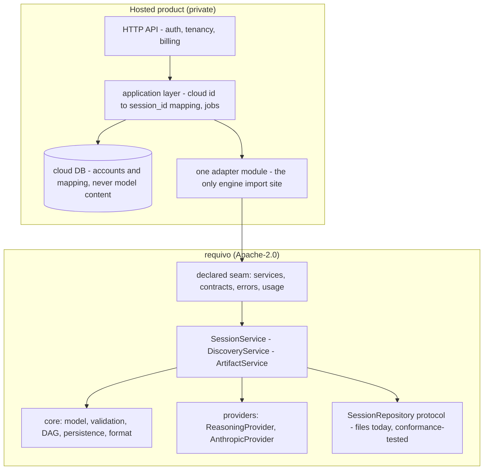

# The cloud boundary

> Where the open engine ends and a hosted product begins: what each side owns, how a private
> deployment consumes the public package, and the short list of upstream changes that make that
> consumption clean.

[open-source-strategy.md](open-source-strategy.md) draws the *distribution* boundary — what is
Apache-2.0 and what stays private — and accepts, in its own words, that third parties may host
Requivo as a service. This page is the *consumption* boundary: the contract any hosted product,
first-party or not, builds against. It is written against a real first-party deployment scaffold, and every gap it names was
observed rather than predicted.

Two rules govern everything below, and each is the other's mirror:

- **The engine never names a cloud noun.** Stripe, Kubernetes, AWS, a queue, a secrets manager, an
  observability vendor — none of these appears in `core/`, `services/`, `providers/` or `render/`,
  ever. The self-hosted story in open-source-strategy.md is only true while a `pip install requivo`
  carries no opinion about anyone's infrastructure, and the rule is the same shape
  `tests/test_source_form.py` already enforces for provider imports: a cloud noun in the engine
  would earn a row there, with its reason.
- **The hosted product never reimplements an apply, a generation, or a staleness rule.** CLAUDE.md
  already says it for the three local surfaces — *"there is never a second implementation of an
  apply, a generation, or a staleness rule"* — and a hosted deployment is the fourth surface, not
  an exception. The standing counterexample is instructive: an adapter written before the facade existed
  calls the provider layer's free functions plus `SessionService` directly — the exact shape this
  repo's own CLI had before #77 — so its refinement turn applies with **no** `expected_revision`,
  its generations persist **no** artifact and track **no** staleness, and nothing stamps what a
  call spent into provenance. None of that is
  a cloud feature gap; all of it is orchestration `DiscoveryService` already owns. The fix is the
  same as #77's: consume the service, delete the second implementation.

## 1. The responsibility split

The membership test for any new concern: **would a self-hoster running `requivo web` need it?** If
yes, it belongs in this repository; if it only exists because more than one person shares a
deployment, it is cloud-only.

| Concern | `requivo` (Apache-2.0) | Hosted product (private) |
|---|---|---|
| Engine & model | slots, validation, readiness, the dependency DAG, diff/impact | — |
| Services | `SessionService` / `DiscoveryService` / `ArtifactService` — the only apply, generate and staleness implementations | — |
| Persistence contracts | `SessionRepository` protocol, the session format + `migrate_session`, locks | the Postgres *implementation* of the protocol (see open questions), the managed database, backups |
| Providers | `ReasoningProvider` protocol, the Anthropic implementation, the dated rate tables | per-tenant key custody, quotas, spend enforcement |
| Interfaces | CLI, local Web, a future local API (same shape: local, single-user, no auth), the Claude Code plugin | the hosted HTTP API, the product UI, admin |
| Integrations & adapters | epic export, the pure `to_github()`/`to_gitlab()` transforms | the authenticated pushes those plans feed (deliberately out of this repo already), webhooks, inbound email |
| Accounts & tenancy | — | accounts, organisations, tenancy, cloud auth, billing |
| Execution | — | workers, queues, scheduling, retries |
| Ops | — | secrets management, observability backends, infrastructure |
| Format & migrations | `format_version` / `schema_version` frontiers and every migration | the *operational* discipline around them (§8) |

## 2. The consumption contract

**Today there is none, and [compatibility.md](compatibility.md) says so on purpose**: *"Python
internals … are importable and documented, but they are the engine's own structure, not a published
API."* That sentence was right while the only consumers were this repository's own surfaces. The
moment an external deployment pins the package, it consumes undeclared internals — which is why the
first-party scaffold routes every import through one adapter module, and why an early pin could
sit majors stale without anything going red.

The contract this page proposes, in three parts:

- **A declared seam, kept deliberately small.** The services (`SessionService`,
  `DiscoveryService`, `ArtifactService`, their result types), the two protocols
  (`SessionRepository`, `ReasoningProvider`), the contracts a consumer holds in its hands
  (`EngineOutput`, `SessionMeta`, `ArtifactStatus`, the artifact contracts `generate` returns), the
  failure vocabulary (`requivo.core.errors`, `requivo.providers.errors` — the *codes* are already
  promised; this adds the classes), and the ledger (`requivo.usage`). Everything else stays
  explicitly unstable. The declaration is a section of compatibility.md, priced like everything
  else on that page: moving a declared name costs a major.
- **`py.typed`.** The package ships no PEP 561 marker, so a typed consumer cannot even check its
  own adapter against the seam. One empty file plus a packaging line; it turns the declared surface
  from prose into something a type checker holds.
- **The pin: exact, not a range.** Three majors shipped in thirteen days (v1.0.0 on 2026-08-20,
  v2.0.0 on 2026-08-31, v3.0.0 on 2026-09-01), because a major here prices a break to *anything* on
  the compatibility page — usually the CLI, the `--json` envelopes or an HTTP status, and almost
  never the Python seam. Under that cadence a range ceiling reads as prudence and works as
  starvation: an observed early range ceiling quietly aged majors behind. So: `requivo==X.Y.Z`,
  bumped as a routine chore whose gate is the conformance suite below plus the consumer's own
  tests. A compatible-release range is worth revisiting only after the declared seam has survived
  several majors untouched — a decision then, not a default now.
- **The repository conformance suite.** `tests/test_sessions.py` already proves the services are
  backing-agnostic with an in-memory `SessionRepository`
  (`test_session_service_runs_unchanged_on_a_non_file_repository`). That proof is the seed of a
  suite a *consumer's* backing must pass: extracted into the wheel (a test base class parametrised
  over a repository factory), covering what the services actually assume — lock mutual exclusion
  and per-thread re-entrancy (invariant 9), `save_revision`'s `expected_revision` refusal
  (invariant 2), the three-state listing (`list_slugs` / `list_unexaminable` — invariant 15's third
  answer), `load_artifact`'s *None means absent, raise on refusal* rule, and unknown-key
  preservation through a meta round-trip (invariant 8). A Postgres implementation that passes it
  inherits the services verbatim; one that does not has found its bug before production did.

## 3. The upstream change set

Ordered; each entry says why a hosted consumer needs it and what it does until the change lands.

### 3.1 #272 — the workspace becomes constructor state

Every `core/persistence` function resolves `session_root()` from `REQUIVO_WORKSPACE`/cwd per call,
so `FileSessionRepository` — the seam documented as Postgres-swappable — has an identity that lives
in process globals. The recorded consequence for any hosted consumer: pointing the engine at a chosen
directory means mutating `os.environ`, and doing that safely means a process-wide mutex that
serialises *every* engine call — and an engine call runs minutes, so one tenant's discovery parks every other
tenant's request behind a lock for its whole duration. Concurrency ceiling: exactly one.

**Constructor state, not a ContextVar — and the threadpool fact cuts the way you might not
expect.** A task-scoped `ContextVar` root would survive the async boundary: verified against the
installed anyio 4.12.1, `to_thread.run_sync` copies the caller's context at submission
(`copy_context()`) and the worker thread runs inside the copy, and FastAPI's sync-def handlers go
through exactly that path. What disqualifies it is everything else: a job-queue worker is another
*process*, which no context crosses, and an unbound root var falls back to cwd — a silent
data-placement hazard, this repo's least favourite kind of correct-looking behaviour; one context
cannot address two roots at once, and `DiscoveryService`'s constructor comment — *"one repository
per service, chosen once, is the only shape that cannot split"* — is a statement about instance
state; and the audit's finding was that the repository's identity leaks out of its constructor —
a ContextVar improves the leak's isolation, not its invisibility. The repo's own precedent already
draws the line: the usage ledger is a ContextVar because "no ledger" is a safe no-op; "no root" is
not.

Shape (the issue's own proposal, with the second of its two options recommended):
`FileSessionRepository(root=None)` defaulting to `paths.workspace_root()` — CLI and env behaviour
byte-identical — with the store's operations addressed through an object holding the roots rather
than a parameter threaded through ~40 module functions, so the change has one construction site and
the module-level functions survive as the ambient-default wrappers the CLI keeps calling.

**Meanwhile:** the env-mutating workaround is correct, just serial. Its honest interim upgrade is a
process-based job queue whose workers run one job at a time: `REQUIVO_WORKSPACE` set at job start
in a single-flight process is race-free, so N worker processes lift the ceiling from 1 to N before
any upstream change lands.

*Flagged, out of this set:* `user_context_dir()` (`REQUIVO_CONTEXT_DIR`) is a second ambient root
with the same disease. It stays untouched until per-tenant context cards are a real feature —
open-source-strategy.md already marks company-specific cards private, so they will eventually need
a per-workspace or injected card source rather than a process-global directory.

### 3.2 The declared seam + `py.typed` (#423)

Why: §2 — until the seam exists, every hosted import is a bet on internals two refactors have
already moved (#73, #74/#167). **Meanwhile:** the single-adapter-module rule (exactly one module
imports the engine) plus the exact pin bound the blast
radius of any move to one file and one deliberate bump.

### 3.3 The error-to-status table leaves the `[web]` extra (#422)

`_STATUS_BY_CODE` — every published error code's HTTP status, with the 4xx/5xx reasoning and a
guard (`test_every_error_code_has_an_explicit_http_status`) — lives in `web/app.py`, behind the
optional `[web]` extra and an import chain that needs Jinja2. So the hosted API cannot reach the
one table that answers "whose fault was this?", and the observed result is a blanket translation:
every `RequivoError` becomes a 502. `revision_conflict` — a 409 with a precise remedy (reload,
re-answer) — reads as an upstream outage; `session_not_found` reads as a gateway fault. That is #34's
misattribution bug, reintroduced wholesale one repository over, and it is #167's playbook in
reverse: the fix is to move the neutral concept out (a sibling of
`usage.py`/`streams.py`, exporting the table and `http_status_for(error)` — the module name is
#422's implementation call), never to have the
consumer keep a copy. `requivo.web` imports it; the guard test keeps walking the subclasses.
**Meanwhile:** special-case `session_not_found` → 404 and `revision_conflict` → 409 in the cloud
handler and accept the drift, dated.

### 3.4 The repository conformance suite is extracted (#424)

Why: §2's last bullet — the Postgres backing must honour what the services assume, and today the
assumptions are proven only by an in-memory class inside this repo's own tests. **Meanwhile:** the
consumer vendors a copy of those assertions against its implementation, accepting drift the same
way as 3.3, dated.

### 3.5 #238 — delete on the protocol, as erasure

The issue is filed as product UX (every experiment lives on the home page forever); the hosted
consumer needs its store half for a harder reason: tenant offboarding and erasure requests must
reach the store through the same seam as every other mutation, or they bypass the service layer —
invariant 14's exact warning, made legal. The protocol grows `delete(slug)`; the file
implementation takes the session lock, removes the directory, and unlinks the lock file last —
possible in that order precisely because #113 moved the lock outside the directory it guards — so a
concurrent writer conflicts cleanly instead of writing into a half-removed tree. Erasure semantics:
the directory *is* the session — model, revisions, artifacts, request text — so removal retains
nothing. The CLI verb and the web affordance are the same issue's other slices; the hosted product
needs only the protocol + store half first. **Meanwhile:** a per-session workspace layout (§4)
makes retiring the whole workspace directory an acceptable stand-in — acceptable
*only* under that layout; on a shared per-tenant workspace it would be exactly the lock-skipping
`rm -rf` the issue warns against.

### 3.6 Optional model-id injection on the provider (#434) — landed

The per-tenant *credential* needed no upstream change: `AnthropicProvider(client=…)` already accepted
a constructed SDK client and `DiscoveryService(client=…)` threads it through. The model id was the
missing half: `_complete()` resolved it from `REQUIVO_MODEL`/`MODEL` per call, so per-tenant or
per-plan model selection meant process-env mutation, which races across concurrent calls in one
process. `AnthropicProvider(client=…, model=…)` now takes an optional fixed model id, threaded into
every completion call, `model_name()` and `provenance()`; the default (`model=None`) is the
pre-existing `REQUIVO_MODEL`/`MODEL` env-chain resolution, byte-identical, with no env read at all on
the explicit-id path. Two `AnthropicProvider` instances in one process, each constructed with its own
id, now call, price and record independently — the shape a per-tenant or per-plan model deployment
needs, and the deferred Fable A/B evaluation this issue names as a consumer. `DiscoveryService` itself
is not wired to accept or forward a model id yet; a hosted consumer reaching for this constructs its
own `AnthropicProvider(client=…, model=…)` and passes it to `DiscoveryService(provider=…)` until that
wiring is a separate, deliberate change.

## 4. Identity and tenancy

- **Slugs stay what they are: workspace-scoped naming.** Unique within one workspace only, minted
  from the request, re-minted with a hash suffix on collision. A slug is never a global key and
  never becomes one.
- **`SessionMeta.session_id` is the stable key.** A uuid4 stamped at creation (uuid5 for sessions
  brought in from the legacy layout), carried in `session.json`, and therefore the one identity
  that survives `session export` / `session import` and any future rename. The hosted mapping row
  records it; a cloud-side public id may exist alongside, but the join to the store is this field.
  (A consumer minting its own id without recording the engine's has one identity too many.)
- **Cloud owns the mapping** tenant / cloud-id → (workspace root, slug), and the layout. Two
  legitimate layouts: **one workspace per session** (strongest isolation,
  delete retires the directory, the DB is the only tenant-level listing) and **one workspace per
  tenant** (engine-native `session list`, whole-workspace export — the "continue locally" story —
  at the cost of a tenant-visible slug namespace and a genuinely shared write domain). Start
  per-session; per-tenant is a product decision to take deliberately.
- **The invariants a deployment must preserve, whatever the layout:**
  1. **One kernel per workspace at a time.** Every exclusion here is an advisory `flock` — the
     30-second-bounded `session_lock`, and the `_discovery_guard` held *across* a paid provider
     call to refuse a concurrent first discovery before it spends anything (#209). A flock excludes
     only writers on the same kernel: two pods over one network volume are two kernels, and every
     one of those guarantees silently stops existing. Pin each workspace's writes to one node —
     with per-session workspaces, "one in-flight job per session" (queue dedup) is sufficient — or
     front the store with a distributed lock the deployment owns. The engine will not grow one:
     that is a cloud noun (rule 1).
  2. **Locks are advisory, so bypass is always possible** — which is why erasure belongs on the
     protocol (§3.5) rather than in a `shutil.rmtree`.
  3. **Never two engine versions writing one workspace concurrently.** compatibility.md's
     mixed-version promises are about tolerance across *time*, and its own note records that an
     older Requivo locks a different file than a newer one. A deployment controls its image, so
     this costs nothing: one engine version per deployment, drain in-flight jobs across an upgrade.
  4. **The workspace is the unit of consistency.** Tenant-wide search and analytics read the cloud
     DB or exported snapshots — never a glob across live workspaces under write load.

## 5. Statelessness and jobs

A provider call is synchronous, non-streaming, and runs seconds to minutes by design
(`MAX_OUTPUT_TOKENS` is 16k because the SDK risks HTTP timeouts above it). The engine is
synchronous Python throughout — and at this seam that is a feature: sync code runs identically
under a threadpool and in a queue worker, so the deployment chooses the execution model and the
engine's guarantees hold under both.

**Request-held threadpool** (sync-def routes → Starlette `run_in_threadpool` →
`anyio.to_thread.run_sync`). What the engine guarantees: ContextVars *do* cross into the worker
thread — verified against anyio 4.12.1, which copies the caller's context at submission and runs
the function inside the copy — so a `track_usage()` scope opened in the handler is the ledger the
provider's `record_call` files into, and two concurrent requests keep separate ledgers by
construction. What it does not fix: the request holds a threadpool slot for the whole reasoning,
and a client timeout, an LB idle limit, or a redeploy lands mid-call — tokens spent, apply never
landed.

**Job queue** (recommended once real users exist): enqueue `{session_id, operation,
expected_revision}`, worker executes the `DiscoveryService` operation, client polls or streams the
row. A queue worker is a CLI-shaped caller, which is the caller this engine is hardened for:

- **Bind the ledger at job start.** No context crosses a process boundary; `track_usage()` opens
  inside the job. Forgetting is tolerated by the engine (`record_call` no-ops with no ledger open),
  which means spend silently unrecorded — so the worker harness owns the binding, not each job body.
- **Snapshot discipline is the engine's, not the deployment's.** Every reasoning operation takes
  one coherent `SessionSnapshot` under the session lock (invariant 12), releases the lock before
  the paid call, and carries the snapshot's revision as `expected_revision` into the apply and as
  `source_revision` onto the artifact — so interleaved writes become a clean `revision_conflict`
  (409, §3.3) or an honestly-stale artifact, never a silent overwrite. `generate("brief")` even
  survives losing the race: the paid assessment is still saved against its true source revision,
  flagged stale, with the conflict named (#208).
- **Crash story = the CLI's ctrl-C story.** Both flocks are kernel-held and die with the process;
  the only residue is a dot-prefixed scratch file, the class the store already documents. A retried
  first-discovery job is refused free by the revision-zero gate before it can pay; a retried
  refinement conflicts cleanly on `expected_revision`. Queue-level dedup (one in-flight job per
  session) is the deployment's complement to the kernel-scoped `_discovery_guard`.

## 6. Eventing and observability

Landed (#435). Before this, the engine's layers emitted **zero** log records (the one logging
configuration in the tree belonged to the local web surface — `web/logging_setup.py`), and
invariant 7 already blessed `logging` as the library-correct way of not printing. What shipped is
minimal and stdlib-only, and — one thing the original proposal for this section did not name —
required a second mechanism beyond simply not calling a handler-configuring function: with nothing
configured *anywhere in the process*, a WARNING+ record from any of these loggers reaches Python's
own `logging.lastResort`, which prints straight to stderr regardless of what this package does.
`requivo/__init__.py` attaches a `NullHandler` to the top-level `requivo` logger at import — the
stdlib-documented way a *library* stays silent — which absorbs that fallback for every descendant
logger through ordinary propagation, without adding any handler an embedding application would
have to notice or displace.

- **Named loggers at the service seams** — `requivo.services.discovery`, `.sessions`,
  `.artifacts` — emitting the handful of events an operator acts on: a session created, a model
  applied (slug, revision, changed/stale counts), a write conflict refused, an artifact saved (type,
  source revision, stale verdict), and a provider call started/finished/failed (operation, duration
  in ms) at the orchestration layer. No handlers, no formatters, no configuration: silent by
  default, attachable by anyone.
- **`requivo.providers.anthropic.completion` (optional, a child of `requivo.providers...`)** — the
  one place a call's *attempts* and latency are actually known, since every other layer only sees
  the typed result or a raised error. Logs a call completed (DEBUG) or gave up (WARNING) — a
  transport failure, a truncated reply, or the retry loop exhausted — with the operation, model,
  attempts and latency. A caller wanting per-HTTP-call detail attaches here or to `requivo.providers`
  and gets it via propagation; nobody does by default.
- **An `operation` field on `CallRecord`** (optional, default `None`). The ledger records model,
  tokens, cache tiers, latency and the rate a call was billed at — but not *which operation* spent
  them, so per-verb metering ("a brief costs X, a discovery turn Y") was reconstruction. One
  additive dataclass field, stamped at every `_complete()` call site in `providers/anthropic/
  generators.py` with the same vocabulary `_OP_PROMPTS`/`cli.py`'s subcommands already use
  (`analyze`, `brief`, `stories`, `prd`, `criteria`, `epic`, `release`, `estimate`). Nothing in this
  package reads it back yet — no renderer, no `--json` envelope — so today its only consumer is
  whatever an embedding operator builds against the ledger themselves.

Everything else attaches on the deployment's side: handlers, OTel, request-id correlation, metrics,
billing pipelines reading the ledger per job, alerting. And deliberately **no more than this** — no
event bus, no callback registry, no middleware seam. A logger *is* the hook, and the bar for
anything richer is the repo's own two-named-instances rule (#288): two real consumers with needs a
logger cannot serve, named by issue number.

## 7. Secrets and configuration

Local configuration stays env-only and SDK-resolved, unchanged: `new_client()` takes no arguments
on purpose — it asks the SDK to run its whole credential resolution (env vars, profile, workload
identity federation, #334) and refuses cleanly when nothing resolves.

A hosted deployment never touches that path. It constructs the SDK client itself and injects it —
`AnthropicProvider(client=Anthropic(api_key=<tenant key>))`, or the same through
`DiscoveryService(client=…)` — so per-tenant credentials involve no environment writes and no new
upstream surface. Custody, rotation and encryption-at-rest of tenant keys are cloud-only concerns,
and the engine holds no key anywhere: provenance records provider, model, prompt hash, surface and
spend — never a credential. The model id is the one vendor fact still ambient after client
injection, and §3.6 is its fix. After #272, no `REQUIVO_*` variable remains on the hosted hot path;
`REQUIVO_CONTEXT_DIR` is the flagged remainder (§3.1).

## 8. Migrations: `format_version` is the auto-upgrade contract

The frontier already exists and is exactly what a fleet wants. Every `session.json` carries
`format_version` (today **1**) and `schema_version`; `migrate_session()` upgrades an older dict on
load and refuses a newer one with a structured error (`unsupported_format_version` /
`unsupported_schema_version` — 409s in the shared table). Adding a field is free in both directions
— both files are `extra="allow"` since #14, and unknown keys survive a round-trip — while renaming
or repurposing a populated field costs a version bump and a migration, with
[compatibility.md](compatibility.md) updated in the same change.

What that buys a deployment: **engine upgrades need no data migration.** A newer engine opens every
stored workspace and upgrades lazily at the version frontier; an eager sweep, if wanted before a
rollout, is nothing more than open-and-save per session, because the migration *is* the load path.

The deployment's obligations in return:

- **Forward-only across a format bump.** An older engine refuses what a newer one has written —
  correctly, by contract. Since the deployment controls its image, this costs a drain: no
  in-flight jobs from the old version once the new one starts writing (§4, invariant 3).
- **`session.json` and `model.json` are engine-owned.** The cloud DB never holds parsed model
  content as authoritative; it may cache for display, keyed by revision and invalidated by
  revision, because the revision is the one fact the engine promises about change.
- **The refusal travels to any backing.** When a Postgres repository stores sessions as rows, the
  same frontier applies under the same rule, and the conformance suite (§3.4) is where that gets
  pinned — a database backing must refuse a newer format the way the files do, not half-understand
  it.

