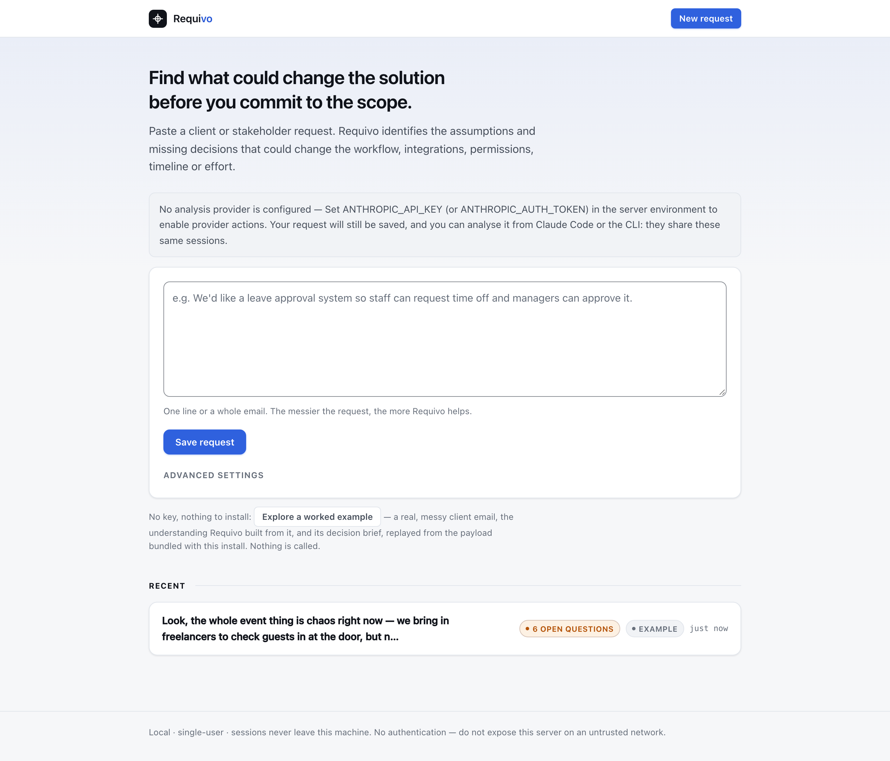
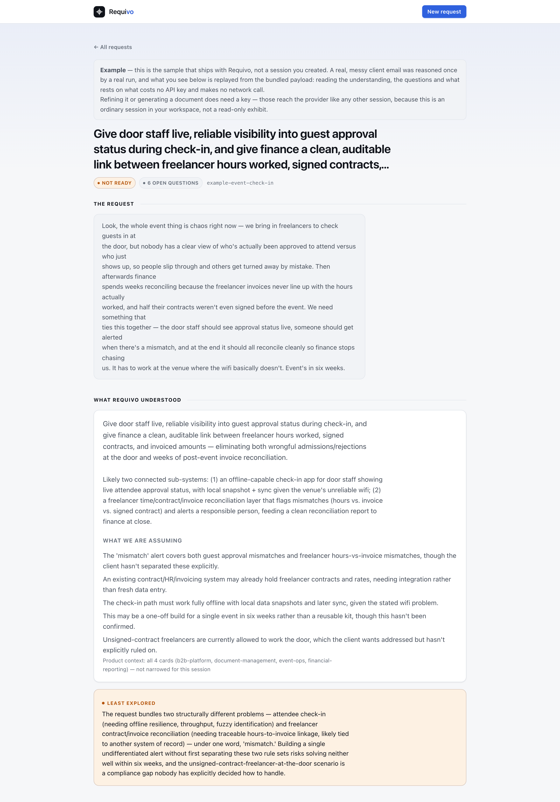
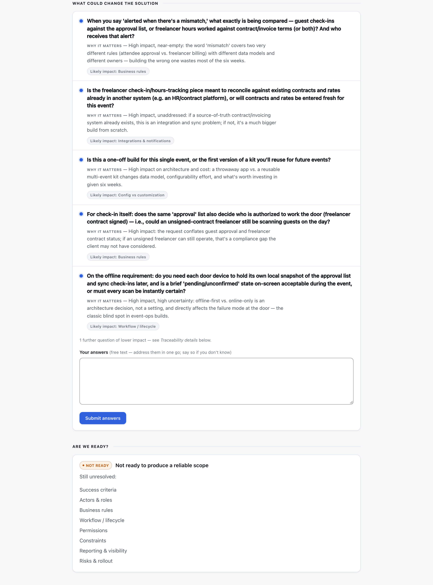
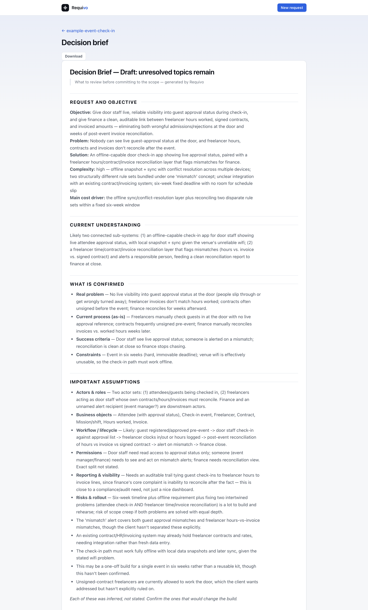

# Requivo Web

The **primary Requivo interface**: a local, single-user, self-hostable browser workspace over the same
Core, services and session format as the CLI and the Claude Code plugin. It is where the product's
workflow lives — paste a request, work through what could change the solution, and leave with a
decision brief. Sessions it creates open in the other two, and theirs open here.

"Primary" is about weight, not capability. The CLI can do everything this can and more; it is
infrastructure. This is the one to hand someone who has a request and half an hour.

Requivo Web is deliberately small — see [Scope](#scope).

## Install

```bash
uv tool install "requivo[web,anthropic]"   # web UI + the Anthropic provider (for discovery/generation)
uv tool install "requivo[web]"             # web UI only — review existing sessions, no provider
```

For development from a checkout:

```bash
uv sync --extra web --extra anthropic
uv run requivo web --no-open --port 8765
```

The web dependencies (FastAPI, Uvicorn, Jinja2, python-multipart) are an **optional extra** — they are
never imposed on CLI or Claude Code users. The templates, CSS and a vendored copy of HTMX ship inside
the wheel, so nothing loads from a CDN and the UI works offline.

## Run

```bash
requivo web \
  --workspace .        # where sessions live (default: current directory)
  --host 127.0.0.1     # default; localhost only
  --port 8765          # default
  --no-open            # do not open a browser automatically
  --reload             # auto-reload on code changes (development)
```

By default the server binds to `127.0.0.1`, prints its URL, and opens your browser. A credential
(`ANTHROPIC_API_KEY`, or `ANTHROPIC_AUTH_TOKEN` for a bearer-token setup) is read from the **server
environment** — it is only needed for provider actions (discovery, generation); reviewing existing
sessions needs no key. The credential is never shown in the browser, never a form field, never logged.

### Binding beyond loopback

`--host` accepts any address, and reaching the app from another machine needs two things, not one:

```bash
REQUIVO_WEB_ALLOWED_HOSTS=192.168.1.50 requivo web --host 0.0.0.0
```

- **The bind address** (`--host`) is what the process listens on. `0.0.0.0` (or `::`) means "every
  interface", which is not itself a value a browser can ever send back — no client addresses a server
  as `0.0.0.0`, it addresses whatever hostname or IP it actually connected to.
- **The allowed-host list** (`REQUIVO_WEB_ALLOWED_HOSTS`) is what the cross-site guard's `Host`
  allowlist accepts (see [Security](#security-local-by-default)). It has to name the real address —
  the LAN IP or hostname a client's browser will put in its `Host` header — because that check runs
  on every request, reads and writes alike, and is the one line of defence against DNS rebinding.

A wildcard bind address is **not** auto-allowlisted, on purpose: doing so used to record the literal
string `"0.0.0.0"` in the allowlist, which satisfied nothing a real client ever sends, so
`--host 0.0.0.0` alone looked like it worked — the process bound, the URL printed, the browser opened
on loopback — while every actual LAN request got a 403 `host_not_allowed` with no obvious cause. A
non-wildcard address (`--host 192.168.1.50`) *is* auto-allowlisted, because that literal value is
exactly what a browser connecting to it will send.

**There is still no authentication and no TLS.** Binding beyond loopback puts the request token and
every session's content on the network in plain text to anyone who can reach that interface — a
reverse proxy terminating TLS in front of it is the supported way to go further than a trusted LAN.

## The workflow

One path leads the product, and the interface is built around it rather than around the model:

```text
paste a request
  → read what Requivo understood
  → answer the few questions that could change the solution
  → see what those answers moved
  → generate one decision brief
  → change an answer later and see what needs review
```

### What it looks like

Four moments from one session, in order. The engine's own vocabulary — slots, coverage, revisions —
is not on any of these screens; the translation is defined once in `web/viewmodels/labels.py`.

All four are produced by `python scripts/shoot_doc_images.py`, from the bundled example seeded as a
real session — no key, no network. `tests/test_doc_images.py` fails when the web surface moves after
they were taken, which is the half that was missing when two of them went stale in content and
nothing noticed (#329).









- **Explore a worked example** — one button under the request box, and the way to see a finished
  analysis *and* its decision brief without a key (#429). (It is not the only keyless thing here:
  with no provider configured the main form still captures a request, and the button says *Save
  request* rather than *Analyse request* to say so.) It materialises the bundled sample — the messy
  client email `requivo demo` replays — as a real session in your workspace, through the same
  `SessionService.create_session` + `update_model` path everything else uses, and its decision brief
  through the same `ArtifactService.save` path a real generation does. It is not a read-only
  exhibit and not a mock: it has a revision, a frozen copy under `revisions/`, a readiness verdict
  computed by the same code as yours, and it opens in the CLI and in Claude Code. Nothing is called
  and nothing is reasoned; the payload ships in the wheel, brief included. Refining the session or
  generating any *other* document does need a key. The button stays after you have sessions
  of your own — showing it only on an empty workspace would put the example one real session out of
  reach — and clicking it twice returns you to the session you already have rather than making a
  second. It is labelled *Example* on its own page and on its row, and that label is decided by the
  request it carries, not by the name it landed under (#226).
- **Home** — the request box *is* the home page; there is no separate "new discovery" screen. Below it,
  the requests already in progress, each showing what was asked, whether it is waiting on you, and
  whether a document needs updating. Sessions created by the CLI or Claude Code appear here too. A
  session that cannot be read — written by a newer Requivo, or left with a truncated file by a crash
  mid-write — is a **row that says so and names itself**, not an error over the whole page: one bad
  session used to hide the list of every other, and neither surface said which one it was (#7). The
  row shows one line and links to the session, where the failure is stated in full with what to run
  next. That line is the store's own sentence when the store already wrote one for a reader — *this
  session came from a newer Requivo, upgrade requivo* keeps its remedy on the first screen — and a
  plain sentence when it did not: a pydantic class name, an absolute path or `[Errno 21] Is a
  directory` used to lead the row, on the page whose design rule is that engine vocabulary never
  does (#240).
  Opening that session answers with the status it always did (409 for a session from a newer
  Requivo, 500 for a store that could not answer), and the same failure is logged in the terminal
  you started the server in.
  The list is ordered by when each session last moved, newest first, and a row nobody could read
  sorts last — it states no timestamp at all, and an empty string would otherwise sort it to the top
  (#237). Times read as *3 days ago* or *25 Aug 2026*, with the exact instant on the row's `title`.
  The ordering lives in the view model, not in `SessionService.list_entries()`, which stays sorted by
  slug because `requivo session list` is a public surface whose order other callers read.
- **Advanced settings** — session name, product context cards, and whether to analyse now or just save
  the request. Collapsed by default: the server already knows whether a provider action can run, so it
  resolves that itself instead of asking. The API key is never a form field.
- **Session** — the request, what Requivo understood, at most five questions (each with *why it
  matters* and its likely area of impact), the answer form, *Are we ready?* in one action state with
  its reasons, and the decision brief. **The answer form is unconditional.** Questions run out — that
  is what *Ready for a first decision brief* means — and the box stays, reframed as *Anything to add?*,
  because the engine having nothing further to ask is an answer about questions, never an answer about
  what you still have to say: a correction, a constraint that arrived late, scope the client added
  afterwards. It used to be nested inside the question list and vanished with it, which closed the only
  route into the model at the moment the model converged (#49).
- **Answer** — submit answers; the understanding is refined as a new revision (optimistic-locked), and
  the page leads with **What changed**: which parts of the solution moved, which decisions and
  assumptions need review, and which documents need updating. All of it computed from the dependency
  graph, never generated.
- **Generate** — the decision brief is the one primary action. PRD, acceptance criteria, epic and
  release notes live under *More documents*. Each is saved with its source revision and marked *Draft*
  when high-impact topics are still unresolved. Nothing is ever regenerated on your behalf.
- **Traceability details** — one disclosure holding everything the engine knows: the per-topic
  understanding, coverage, every open question, the decisions and contested premises, provenance, and
  the raw model export. The primary flow works without opening it.
- **Danger zone** — one control, at the bottom of the session page, for the product's own erasure
  primitive (#238): *Delete this session…* leads to an explicit confirmation page naming the session,
  suggesting `session export` first as the undo story (there is no trash), before the POST that
  actually removes it. Deleting redirects home, where the session no longer appears.

## Architecture

Requivo Web is a thin layer — it owns **no business logic**:

- Routes parse the request, call an application **service**, and render a Jinja template. They never
  touch the filesystem, never read or write `model.json`, and never shell out to the CLI.
- Discovery, answers and generation all go through `DiscoveryService` — the *same* orchestration the CLI
  uses — which calls the provider and applies the result through `SessionService` (validate → diff →
  propagate → revision → stale-flag) and `ArtifactService` (save with source revision).
- Readiness, the understanding split and staleness are computed in the Core; the templates only render
  the `SessionService.status()` projection through small view models — no logic in Jinja.

```
browser ──HTTP──> routes ──> DiscoveryService / SessionService / ArtifactService ──> Core ──> .requivo/
                     │                        (the same services the CLI calls)
                     └── Jinja templates + view models (presentation only)
```

### When something goes wrong

A structured `RequivoError` becomes a clean page, never a traceback, and its HTTP status answers one
question: **is this about what you sent, or about the state of the server you sent it to?**

- **4xx — your request.** A name that does not resolve (`404`), a malformed model or selection
  (`400`), a submission over the ceiling (`413`), a write that raced another one (`409`).
- **5xx — this server, or what it depends on.** It cannot read its own context-card directory
  (`500`), it has no cards installed at all (`500`), the model would not return valid output after
  every retry (`502`), or a session lock did not clear (`503`).

That split used to leak: every code the status table did not list fell through to `400`, so a
server-side fault told the reader they had made a bad request. Every code now has an explicit
mapping and a test fails if a new one is added without deciding which side it falls on. The full
table, and what changed for anyone scripting against it, is in
[compatibility.md](compatibility.md#http-statuses-in-requivo-web).

A 5xx is also logged in the terminal you started the server in — the page a reader gets says little
by design, and an operator otherwise has no record of a condition the reader cannot act on.

Those lines carry a timestamp, a level and the logger name, so a 5xx investigated an hour later can
be tied to a request time; and the `INFO` line reporting what a paid call cost is printed too. Both
used to reach Python's last-resort fallback instead — the bare message, interleaved with uvicorn's
formatted lines — and because that fallback is fixed at WARNING, the cost line was not merely
unformatted but dropped entirely, so *no handler* and *nothing was spent* looked identical (#291).

The handler is attached by the `requivo web` verb, which owns the process — never at import and never
in `create_app()`. If you mount this FastAPI app inside your own service, your configuration of the
`requivo.web` logger is what applies: the root logger and uvicorn's loggers are never touched, and a
logger you have already configured yourself is left exactly as you set it. One known limit: under
`--reload`, uvicorn spawns a worker process that re-imports the app without passing through the entry
point, so that development flag's own worker still logs unformatted.

## Security (local by default)

Even though it is a local app:

- The server binds to `127.0.0.1` by default. Passing a non-loopback `--host` prints a warning: there
  is **no authentication**, so the app must not be exposed on an untrusted network. A wildcard address
  (`0.0.0.0`, `::`) additionally needs `REQUIVO_WEB_ALLOWED_HOSTS` set to the real address clients will
  use, or the allowlist below refuses every request — see [Binding beyond loopback](#binding-beyond-loopback).
- **Writes are protected against cross-site requests.** Binding to loopback keeps nobody out — any page
  open in the same browser can post to a known local port without a preflight, and for this app writing
  is the damage (sessions created, provider calls billed). Four checks run in `web/security.py`: a host
  allowlist (loopback, plus anything in `REQUIVO_WEB_ALLOWED_HOSTS` — this is the DNS-rebinding guard,
  and the only one that also runs on reads), the browser's `Sec-Fetch-Site` hint, an `Origin`/`Referer`
  trust-domain match, and a per-process request token rendered into every form. A page held open across
  a server restart needs a reload to pick up the new token.
- **A request that names no host is refused, not waved through.** The host allowlist used to skip
  itself when it could not determine a `Host` — an absent header, or an empty one — so the one request
  nobody could attribute walked past the only check that also runs on reads, and nothing reported that
  it was off (#45). It is now the third state, stated: the refusal says the host could not be
  determined rather than borrowing the wording of a genuine mismatch. This does refuse an HTTP/1.0
  request that sends no `Host` at all; HTTP/1.1 requires one, every browser and ordinary client sends
  one, and HTTP/1.0 is not a supported caller here.
- **The parser refuses an authority it cannot read, rather than answering about it.** `Host:
  evil.com@127.0.0.1` used to resolve to `127.0.0.1` and pass the allowlist, because a URL parser
  correctly discards userinfo — and `Host: 127.0.0.1 evil.com` came back as that whole string, which is
  not a hostname and was refused only by happening to miss the allowlist. Neither is reachable from a
  browser: nothing serializes userinfo into a `Host`, an `Origin` or a `Referer`. It is fixed because
  it is the **third** time this parser answered confidently about an input it should have declined —
  #43 the opaque origin, #45 the undetermined host, and this — and because the first two were closed at
  the caller, which is a guarantee the next caller inherits without re-checking. The refusal is now the
  parser's (#51).
- **Each arm of the guard carries its own error code.** One code, `cross_site_request`, was raised for
  six distinct facts whose `details` payloads had five different shapes between them — against the rule
  this project states in [compatibility.md](compatibility.md), that a code carries one fact and one
  shape. They are now `undetermined_host`, `host_not_allowed`, `cross_site_fetch`, `opaque_origin`,
  `origin_mismatch` and `missing_request_token`, all still 403 (#52).
- **The three loopback spellings are one origin.** `localhost`, `127.0.0.1` and `::1` name one machine,
  so a page served on any of them may post to any other — the host allowlist already accepted them
  interchangeably, and comparing them as strings refused a form that used two at once, with no way
  forward from the error page (#43). A host you listed in `REQUIVO_WEB_ALLOWED_HOSTS` is **not** in that
  equivalence: two real hostnames there must match exactly, because whether they are one trust domain is
  your call and not something the app should infer from one comma-separated list. `Origin: null` — the
  opaque origin a sandboxed cross-site frame sends — is refused; no origin header at all is accepted,
  which is what lets `curl` with a valid token work, and the reasoning for the difference is in
  `web/security.py`.
- **That equivalence is the loopback interface, not this process, and the port is deliberately not
  compared.** A page on *any* loopback port passes the origin check — `http://localhost:3000` as much
  as the port Requivo is serving on — because the comparison discards the port on both sides. That
  predates the loopback-spelling change above and is kept on purpose: the request token is what gates
  the write, and a page on another port cannot read one, because the browser's own same-origin policy
  counts the port and this app sends no CORS headers. Comparing ports here would add nothing and would
  reintroduce the failure it just fixed, since a default port is elided in an `Origin` but spelled out
  in a `Host` (#46).
- Every slug is validated in the Core (strict kebab-case, no path separators or dot segments), so a
  request can never escape `.requivo/sessions/`.
- Only the package's `static/` directory is served — never the workspace, `.requivo`, `.env` or `.git`.
- The Anthropic key is read from the server environment and never rendered into HTML or logged.
- All rendered content is HTML-escaped (Jinja autoescape). The one value rendered with autoescape off
  is a saved artifact, and it is off because the point is to *apply* markup rather than show it (#235):
  `render/html.py` builds the document tag by tag, escaping every run of text that came out of the
  file before any tag is constructed, so nothing a language model wrote or a user edited on disk can
  become live markup. That renderer emits no attributes at all, which is also why it cannot conflict
  with `style-src 'self'`.
- `Referrer-Policy` is **`same-origin`**: the full referrer within this app, and nothing at all to any
  other origin. It was `no-referrer`, which is the one value a same-origin form post cannot survive —
  under it a browser replaces the `Origin` header with the opaque `null`, and the cross-site guard
  refuses that deliberately, so the app's own header made its own entry path unusable in Chrome for a
  release (#47). Note what this header is and is not: it governs requests *our* pages make, never a
  request some other page sends here, so it was never part of the guard's defence — it only ever
  constrained us. `strict-origin-when-cross-origin` would also work and leaks `http://localhost:8765`
  to third parties on an outbound navigation, which buys nothing for a local tool.
- Conservative headers are set: `X-Content-Type-Options`, `Referrer-Policy`, and a `Content-Security-Policy`
  that allows only same-origin assets (so the vendored HTMX and local CSS are the only scripts/styles).
  HTMX is vendored rather than fetched from a CDN for exactly that reason, and because the app is meant
  to work offline; its version and licence are recorded in `THIRD-PARTY-NOTICES.md`.
- **Nothing carrying your material is written to the browser's disk cache.** Every response gets
  `Cache-Control: no-store` except the assets this package ships (#218). A page renders your own
  client request and the model built from it plus the request token, and the model export and the
  artifact downloads are your material in bulk — on a shared machine a disk copy outlives the
  "sessions never leave this machine" promise in spirit, and a cached page is also where the two
  stale states this app apologises for come from: an old `expected_revision` reaching a 409, and an
  old token reaching a 403 after a restart. The rule is keyed on the **path** and fails closed rather
  than on the content type, which is the reflex and would have missed the two downloads (`export` is
  JSON, an artifact download is Markdown). `/static/…` and `/favicon.ico` stay cacheable; nothing is
  said here about *how long*, since an ETag or `max-age` strategy for the bundled assets is a
  separate question.
- Input is length-bounded, and an over-long request or answer is **refused, not truncated** — half a
  request folded into the model reads exactly like a whole one. That refusal is the only bound the
  reader meets: no field carries an HTML `maxlength`, because a browser clips a paste to the remaining
  allowance silently — no event, no message, no visual difference — so an over-long request would
  arrive at exactly the ceiling and sail through the very check written to stop it (#8). The
  client-side affordance this invited now exists and is exactly that shape: past 80% of the ceiling a
  live count appears beside the field, and past the ceiling it says the submission will be refused —
  but it never writes to the field, never adds a clipping attribute and never blocks the submit, so
  an over-long paste still reaches the server and still comes back with your text preserved (#239).
  The ceiling it counts against is rendered from the server's own configuration, so the number you
  are shown and the number you would be refused on cannot drift. With JavaScript off there is no
  counter and, as before, no clipping. Request bodies are capped before they are parsed. An unknown
  context card is an error too: filtering it out would leave an empty selection, which every reader
  downstream treats as "load every card".
- **A refusal costs you the submission no longer.** Refusing was right; the recovery was not. Every
  refusal on the request form was a full-page error whose only affordance was *Back to sessions*, so a
  26,000-character client email that arrived through the clipboard had to be fetched again from
  wherever it came from. The answers box was worse: it posts as an HTMX swap over the region that
  *contains* the textarea, so the error fragment deleted the field the text was typed into. Both now
  re-render in place, with what you submitted still in the form — the request, the session name, the
  context cards you ticked — and the refusal stated beside the field it is about (#30). What is
  refused is unchanged; only what it costs you is.

## Limits of this first version

- Generation covers every document the shared service produces — decision brief, PRD, acceptance
  criteria, delivery epic, release notes. The buttons come from the service's own vocabulary, so a new
  generator appears here without touching the Web. The epic's tracker exports (`epic.json`,
  `epic.github.json`, `epic.gitlab.json`) remain CLI-only; `stories` and `estimate` are terminal
  analyses that produce no document at all.
- Provider calls are synchronous (run in a worker thread so the event loop is not blocked); a request
  waits for the result, with an HTMX loading state. No job queue, no WebSockets. The copy beside a
  provider-backed button says *usually under a minute*, which is what invariants 2 and 12 describe,
  and after ten elapsed seconds the status text starts reporting how long it has been running (#236).
  Nothing changes before then, deliberately: a label that churns from the start is decoration on a
  fast call and says nothing about a slow one, so the *change* is the signal. With JavaScript off the
  static copy is the whole signal, which is why it states what the wait is for.
- **What a paid action cost is stated where it can be, and logged always** (#253). The answers turn
  and a document generation answer with a fragment, so the tokens and the estimate ride the response
  directly. The two paths that create a session or run a deferred discovery answer with a 303 instead
  — a redirect has no body of its own — so `web/spend.py` stashes the same figure server-side, keyed
  by the session slug, and the GET the redirect lands on pops it once: the tab you land on states the
  spend without ever putting a number on the URL, where it could be forged. That store is per-process,
  in-memory and read-once: a restart between the redirect and the following GET loses it (unobservable
  in practice — the hop is milliseconds), and a plain reload of the page you land on does not repeat
  the line — it is a receipt for the action that just happened, not an ongoing charge. Every action is
  also always logged to the `requivo.web` logger, in the terminal you started the server in, whether or
  not there is a page to carry the figure to. The log line is written from a `finally`, so a call that
  failed after spending tokens still leaves a trace — and if that failure was on a first analysis, the
  page you land on states the spend too, for the same reason. Tokens are exact; the cost is an estimate
  carrying the date of the rate table behind it, and a model with no price on file says so rather than
  borrowing a neighbour's rate.
- **One provider call at a time, and that rule belongs to the page rather than to a form.** Every
  generator under *More documents* posts to the same region, so a second click while the first call is
  in flight bought a second paid call whose result the first swap then discarded — generated and saved
  correctly on the server, never rendered, which reads as *it did not work* and invites another click
  (#50). While anything is in flight every submit button on the page is muted, the state is re-asserted
  after each swap (incoming markup carries no `disabled` attribute), and the button actually working
  keeps its spinner at full opacity so the muted ones read as muted rather than broken. None of this is
  a safety mechanism — the server holds the revision lock either way and the page still works with
  JavaScript disabled. It is the interface telling the truth about what is happening.
- Artifacts are rendered as formatted documents (#235). The dialect is closed to what
  `render/markdown.py` actually emits — three heading levels, a blockquote, bullets one level deep,
  ordered items, a pipe table, and bold/italic/code inline — and anything outside it degrades to
  escaped text. No Markdown library is used and none is declared: a general parser would accept a
  superset of that dialect over text a language model wrote, to render constructs nothing here
  produces. The **Download** link is unchanged and still serves the exact bytes on disk.
- Readiness is binary (ready + unresolved topics), as in the Core — no invented "levels".
- **What changed** is shown after the answer that caused it, and is not persisted: reloading the page
  loses the narrative. What *is* persisted is the consequence — each document carries its own "needs
  updating" flag on disk. Keeping a full impact history would mean a new field in `session.json`, so a
  format bump and a migration, for a display; that is a decision to take once real use asks for it.
- Single user, single workspace, no concurrent-editing UI beyond the optimistic-lock conflict message.
  Two tabs cannot corrupt a session — a generation carries the revision it read as a precondition, so a
  concurrent change surfaces as a conflict rather than being overwritten — but the second tab is not
  live-updated; it finds out when it next submits. **It finds out before paying, though** (#205): the
  answers form carries the revision it was rendered at, and when the session has already moved past it
  the conflict is certain the moment the snapshot is read, so the turn is refused there rather than
  after a full paid analysis whose result was guaranteed to be discarded. The precondition on the
  apply stays — it covers the session moving *during* the call, which is a different race.

## Scope

Requivo Web is intentionally bounded to: local, single-user, filesystem-backed, no authentication, no
organizations, no collaboration, no billing, no remote storage, no telemetry, no database, no SaaS
infrastructure.

That is a scope decision, not a missing feature list. Everything the interface does runs against your
own filesystem, and the boundary is what keeps the security posture simple enough to state in a
paragraph — see [SECURITY.md](../SECURITY.md).
